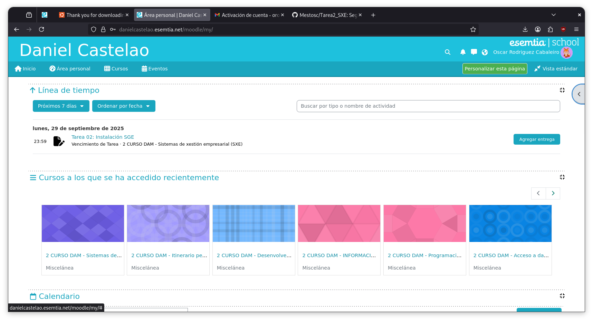

# Guía Instalación Wordpress en Ubuntu Server 24.04

## Instalación
### Instalacion del servidor web

### Base de datos
Aunque esta maquina ya trae una base de datos voy a hacer lo que me dice el tutorial por asegurar compatibilidad y pereza para las cosas, tambien aprovecho y meto algunas

### Descarga e instalacion de Wordpress
Descargamos el comprimido que contiene el aplicativo de Wordpress desde su pagina oficial

Hacemos que la carpeta que contiene wordpress sea la carpeta que el servidor utilizar

## Configuracion
### Configuraciones de la base de datos

Entramos a la base de datos y aplicamos algunas configuraciones

### Configuracion del servidor web
Activamos lo que necesitamos a nivel del servidor apache,segun lo que he buscado

### Configuracion de Wordpress
Introducimos las credenciales de nuestra base de datos en la pagina que wordpress nos proporciona

Luego nos va a mostrar las reglas de configuracion en un archivo **wp-config.php**, diciendome que necesito crear manualmente este archivo que no puede escribirlo, no es un problema lo creo y guardo lo que me indica, de hecho esto probablemente pasa debido a un problema que no vi en este momento con los permisos y que resuelvo más adelante

Tal y como muestro a continuacion

#### Informacion del sitio

### Personalizacion y toques finales

#### Wordpress con el tema activado

## Necesario, dar permisos a la carpeta donde se encuentra Wordpress
Es necesario para que los plugins y temas no den problemas al descargarse

